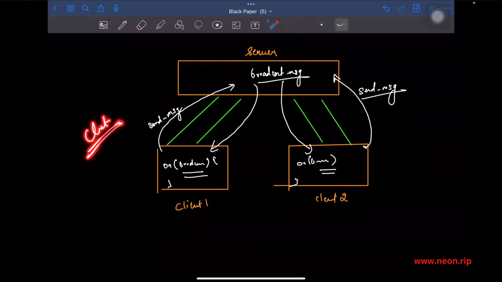
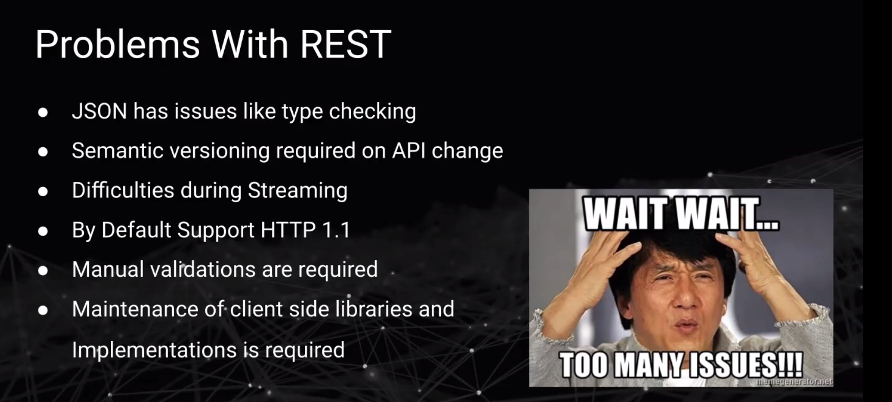
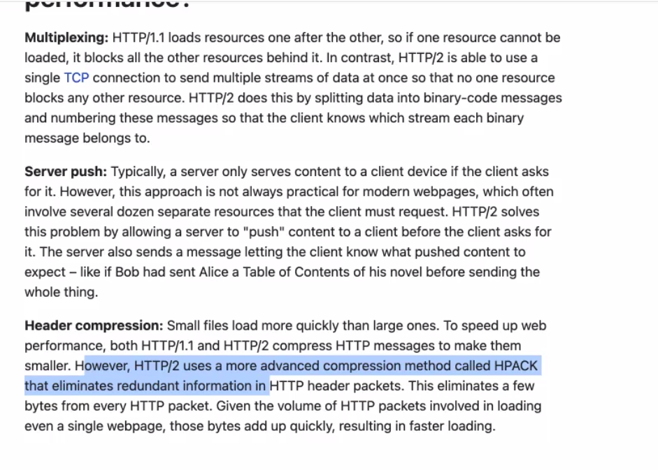
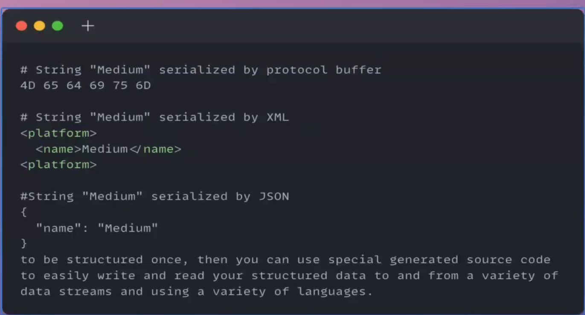
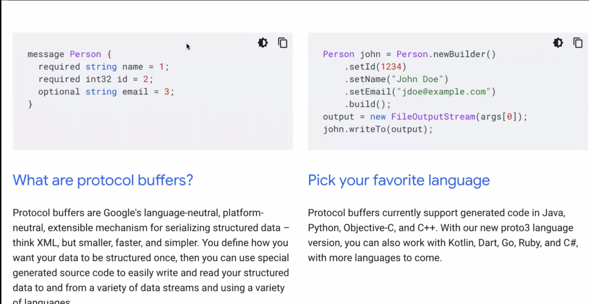

###




## rm -rf .git

## Views engine
## EJS:
npm i ejs


### socket.io:
- # Acknowledgements: blue tick and 
 - Events are great, but in some cases you may want a more classic request-response API. In Socket.IO, this feature is named acknowledgementa.
    
- # Typing in socket.io

- # onKeyPress


### socket events:
- socket.broadcast.emit         -  socket.broadcast in a room
- socket.emit
- io.emit

### Socket.IO methods/events:

- ## socket.enit:
 - Sends an event only to the current socket (the one that sent the message).
 - User types a message and the server confirms that it was received
 ```
    socket.emit('message_status', 'Message delivered');
 ```


- ## socket.broadcast.emit:
 - sends an event to all sockets except the sender.
 - When a user joins the chat, notify others(not the one who joined):
 ```
    socket.broadcast.emit('user_joined', 'Vijay has joined the chat');
 ```

- ## io.emit:
 - Sends an event to all connected clients, including the sender.

 - Broadcast a message to everyone , including the sender:
 ```
    io.emit('new_message', { user: 'Vijay', msg: 'Hello everyone' });
 ```

- ## socket.to(room).emit:
 - sends a message to all clients in a specific room, except the sender.
 ```
    socket.to('room1').emit('msg_rcvd', data);
 ```

- ## io.to(room).emit:
 - Sends a message to all clients in a room, including the sender.

 ```
    io.to('room1').emit('msg_rcvd', data);
 ```

- ## socket.join(roomName):
 - Adds the socket to a specific room.
 ```
     socket.join('room1');
 ```

- ## socket.leave(roomName):
 - Removes the socket from a room
 ```
    socket.leave('room1')
 ```

- ## socket.on('disconnect',...):
 - Fired when a client disconnects,
 ```
    socket.on('disconnect', () => {
        console.log('User disconnected:', socket.id);
    });

 ```

### webrtc vs websocket:


### react socket.io:











## Protobuf serializes and de-serializes

### remote producere call